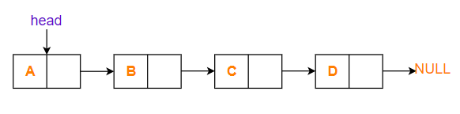

## Свързан списък (част 1)
---

Линейна колекция от данни, за които редът не се определя от физическото им положение в паметта, а от указател към следващия елемент, който всеки възел от списъка има. Списъците са **хомогенни** структури, тоест всеки възел е от еднакъв тип.
Графично изглежда така:

#### Зад.1
Да се състави подходяща структура, която описва възел от тази колекция.

#### Зад.2
Да се състави подходяща структура, която описва свързания списък.

#### Зад.3
Да се напише член функция, която изтрива елементите на списък.

#### Зад. 4
Да се напише функция, която добавя възел в края на списъка.

#### Зад.5
Да се напишат копи контруктор и оператор за присвояване.

#### Зад.6
Да се напише функция `find`, която намира дали възел със съответните данни, ако има такъв.

#### Зад.7
Да се напише функция `findPrev`, която намира възела преди подадения.

#### Зад.8
Да се напише функция `insertAfter(elem, data)`, която добавя възел със стойност `data` след `elem`.

#### Зад.9
Да се напише фунцкия `insertBefore(elem, data)`, която добавя възел със стойност `data` преди `elem`.

#### Зад.10
Да се напише функция `deleteBefore(elem)`, която изтрива елемента, намиращ се преди `elem`.

#### Зад.11
Да се напише фунцкия `deleteAfter(elem)`, която изтрива елемента след `elem`.
