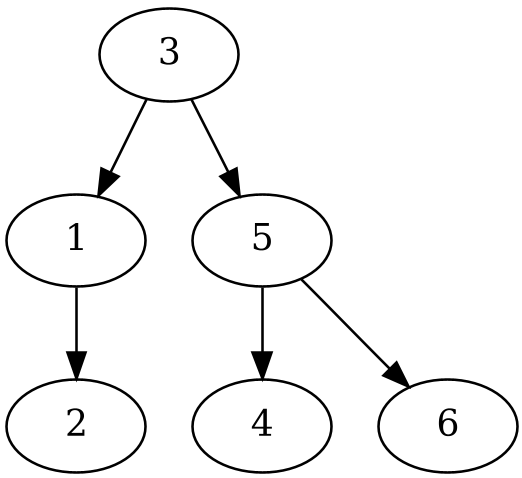
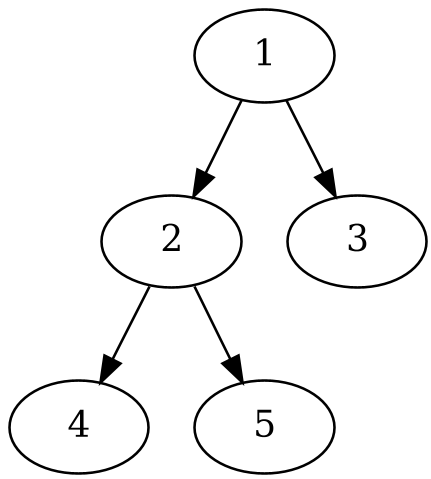

### Задачи за двоични дървета (*продължение*)
---  
#### Зад.1
Функция, която приема двоично дърво и проверява дали то е двоично наредено дърво.
```cpp
template <typename T>
bool isBST(const TreeNode<T> *root)
{

}
```

#### Зад. 2
Да се напише функция, която построява двоично наредено дърво от подаден стортиран масив.
пример:
```
1 2 3 4 5 6
```


#### Зад. 3 
Да се напише функция, която приема двоично наредено дърво и принтира резултата от **обхождане в дълбочина**.
```cpp
template<typename T>
void bfs(const TreeNode<T> *root)
{

}
```

#### Зад.4
Да се напише функция, която приема двоично дърво и принтира на стандартния изход нивата му.
```cpp
template <typename T>
void printTreeLevels(const TreeNode<T> *root)
{
    // TODO
}
```
Например за дървото:

```
1 2 3 4 5
```

#### Зад. 5
Да се нaпише функция, която приема двоично дърво и принтира възлите му по нива, но редът на принтиране да е зигзагообразен. <br>
Например за дървото:

```
1
2 3
5 4
```

#### Зад. 6
Нека са дадени два масива, единият представляващ *inorder traversal* другият представящ *postorder traversal*. Да се напише програма, която построява дърво от тези два масива.
Пример:
```
Вход:
4 2 5 1 3 (inorder)
1 2 4 5 3 (postorder)
```
Получаваме дървото от горе.